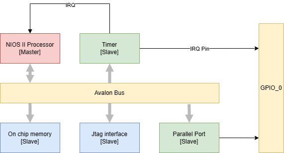
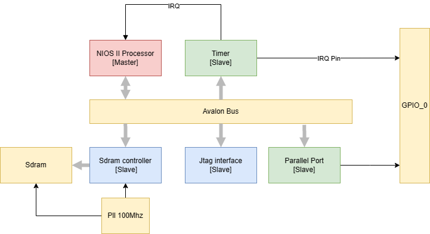
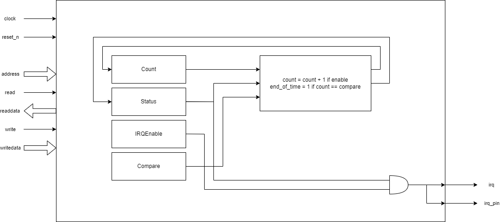
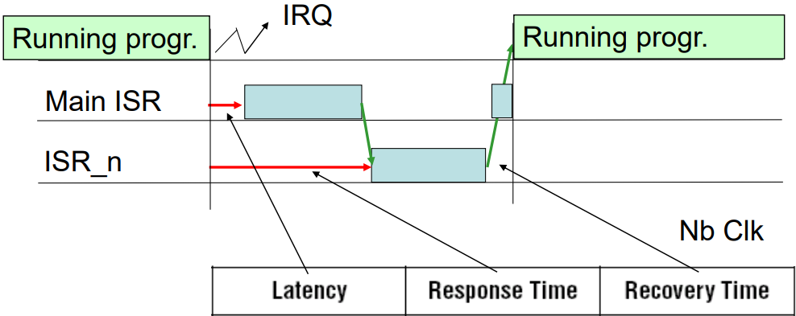
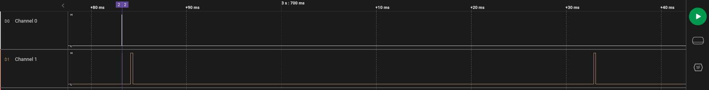

# Lab 1 : Interrupt and OS switching timing measurements Assignment
## 1. Introduction
In applications involving real time constraints, the knowledge of the different timings is crucial when working with an RTOS or bare metal. In this lab we want to measure timings related to interrupts in different configuration and OS switching. We had to create our own timer that acts as a slave in our system to have accurate timing measurements.
## 2. System Architecture
In this lab we are going to measure the timings of a system with two different memory types: on chip memory and sram. Here are the two configurations we will use:

Figure 1 : System with on chip memory

Figure 2 : System with RAM
## 3. Custom Timer
### 3.1 Overview

The timer is a simple component that counts upwards when enabled and generates an interrupt (if interrupts are enabled) when reaching a certain threshold defined by the user. 

Figure 3: Block Diagram of the Timer

### 3.2 Register map

| Name | Address | Used bits | Access | Default | Description |
| ---- | ------- | --------- | ------ | ------- | ----------- |
| Counter | 0x0 | [31..0] | R | 0 | Stores the value of the counter |
| Compare | 0x4 | [31..0] | R/W | 0 | Store the value of the threshold at which the time can send an interrupt |
| Enable | 0x8 | [0] | R/W | 0 | Writing ‘1’ starts the counter, writing ‘0’ stops the counter. |
| EndOfTime | 0xC | [0] | R/W | 0 | Reading the register indicates if the counter has reached the threshold. This can be reset by writing ‘1’ to this address. |
| IrqEnable | 0x10 | [0] | R/W | 0 | Writing ‘1’ enables the interrupt. Writing ‘0’ disables the interrupt. |
| Reset | 0x14 | [0] | W | 0 | Writing ‘1’ resets the counter. |

When the counter reaches the threshold of compare, the EndOfTime register is set to ‘1’ and sends an interrupt if the IrqEnable is set. To clear the EndOfTime register, the user must write ‘1’ in it. The counter can be reset using the Reset register. When reaching its maximum value, the counter will start again from ‘0’.

## 4. Custom Parallel Port
### 4.1 Overview
This is a simple parallel port with input and output capabilities. It also creates interruptions on a rising edge on pin 0 which is used to create the interruptions in the uCOSII timing measurement part. The conduitOUT is connected to the GPIO0 pins from 1 to 8 and the conduitIN is connected to the buttons 1 to 3 (0 being the FGPA reset button). With this custom parallel port we can decide if we want to have the buttons enabled with direction register. The input buttons are mapped to the bits 0 to 2 in the register. 

Figure 4: Block Diagram of the Parallel port
### 4.2 Register map
| Name | Address | Used bits | Access | Default | Description |
| ---- | ------- | --------- | ------ | ------- | ----------- |
| Direction | 0x0 | [7..0] | R/W | 0 | Defines the pins as input (0) or output (1) |
| Pins | 0x1 | [7..0] | R | 0 | Stores the value read from the pins |
| Port | 0x2 | [7..0] | R/W | 0 | Defines what to write to the pins that are outputs |
| Set port | 0x3 | [7..0] | W | 0 | Sets the pins selected by the mask |
| Clear port | 0x4 | [7..0] | W | 0 | Clears the pins selected by the mask |
| Clear interrupt | 0x5 | [0] | W | 0 | Clears the interrupt signal if the bit written is ‘1’ |

## 5. Interruption timings
### 5.1 Setup
Two channels of the logic analyser are plugged into the pins 0 and 1 of the GPIO_0 port to be able to measure respectively the IRQ_pin signal of the timer and the signal that comes from the main ISR. The ground is connected to pin 12.
We are using the NIOSII/f processor with 4kB of instruction cache (if enabled) and 2kB of data cache (also if enabled).
5.2 Timings
There are three different timing we are interested in measuring:
Latency: The time between the interruption and the processor reaching the main ISR.
Response time: The time between the interruption and the processor reaching our custom ISR.
Recovery time: The time it takes the processor to go back to the main program after our custom ISR.

Figure 5 : timings

To be able to measure the latency, we use the logic analyser and we modify the “alt_irq_handler.c” file (which contains the main ISR) to set a pin at the beginning and reset the pin at the end. This will create a rising edge when we enter the main ISR. We then only need to measure the time between the rising edge of the IRQ pin of the timer and the rising edge of the main ISR pin to get the latency. This measurement is in µs and not in a number of cycles. We can notice in the graph below that the main ISR is also used by the Jtag print function. The ISR for the print also takes longer than our own custom ISR (the spikes are longer).

Figure 6 : main ISR is triggered by the Jtag print

To measure the response time, we just read the timer value at the beginning of our custom ISR and subtract the value we set the timer to create an interrupt at. Since we add 1 to the counter at each clock cycle, the measurement will be in clock cycle. One clock cycle corresponds to 20 ns since we are using a 50MHz clock.
For the recovery time, we reset the timer at the end of our custom ISR and read the value of our timer in the while loop of our main function (with the help of a flag). This measurement is also in clock cycles.

### 5.3 Measurements

<table>
    <thead>
        <tr>
            <th>memory type</th>
            <th>instructions cache</th>
            <th>data cache</th>
            <th>latency</th>
            <th>response time</th>
            <th>recovery time</th>
        </tr>
    </thead>
    <tbody>
        <tr>
            <td rowspan=3>On chip emory</td>
            <td>enabled</td>
            <td>enabled</td>
            <td>0.96us</td>
            <td>2.46us</td>
            <td>1.82us</td>
        </tr>
        <tr>
            <td>enabled</td>
            <td>disabled</td>
            <td>1.742us</td>
            <td>3.7us</td>
            <td>3.1us</td>
        </tr>
        <tr>
            <td>disabled</td>
            <td>disabled</td>
            <td>4.48us</td>
            <td>8.66us</td>
            <td>7.12us</td>
        </tr>
        <tr>
            <td rowspan=3>ram</td>
            <td>enabled</td>
            <td>enabled</td>
            <td>0.98us</td>
            <td>3.62us</td>
            <td>2.14us</td>
        </tr>
        <tr>
            <td>enabled</td>
            <td>disabled</td>
            <td>2.46us</td>
            <td>6.9us</td>
            <td>7.36us</td>
        </tr>
        <tr>
            <td>disabled</td>
            <td>disabled</td>
            <td>11.50us</td>
            <td>22.8us</td>
            <td>19.56us</td>
        </tr>
    </tbody>
</table>

Figure 7 : timing results

Those results are what we expected but we noticed some spikes in the measurements for the RAM with instruction cache enabled and data cache disabled.

## 6. OS task switching timings
This part aims at measuring the task switching time of different mechanisms that allow the tasks to communicate with each other in the uCOS real time operating system.
To measure the timings, in the case of the semaphore, we start by locking the semaphore in the main function and create a task that waits for this semaphore to be free. We then have an interruption on a button press that frees the semaphore and this lets the waiting task run. The switching time is then measured by setting a pin at the end of the ISR, resetting it at the beginning of the task and measuring the length of the spike with the logic analyser. The other measurements work in a very similar way.

| Type | Task switching time |
| ---- | ------------------- |
| Semaphore | 22.5us |
| Flag | 30.3us |
| Mailbox | 24.1us |
| Queue | 25us |

Figure 8 : timing results

## 7. Conclusion
With this Tp we could gather some important data that could be very useful when we have to create programs with real time constraints. It also introduced us to some important concepts of real time operating systems.
