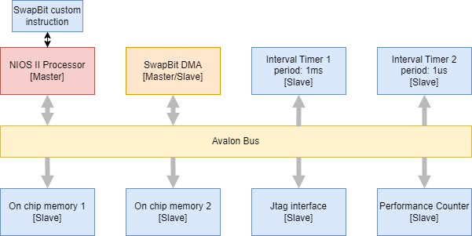
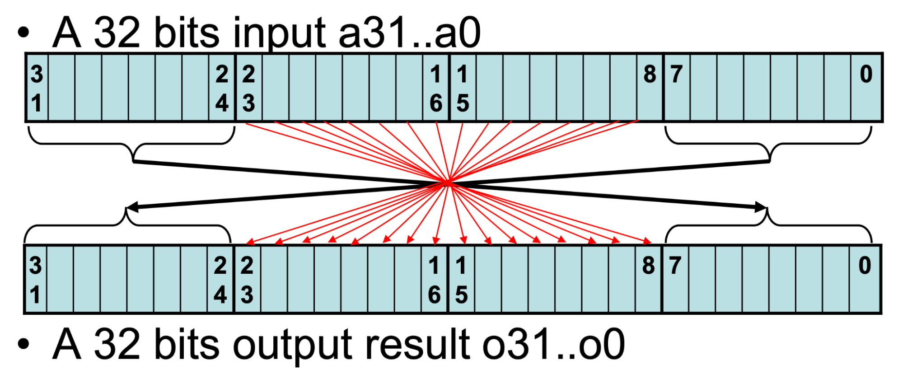
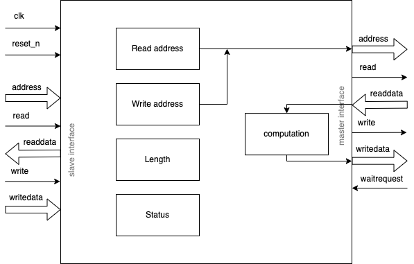
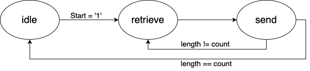

# Lab 2 : Profiling, Custom Instruction and accelerator
## 1 Introduction
For this lab we will profile different types of means to achieve the same goal. The function that we want to implement is a function that will swap bytes and bits from a 32 bits vector. To perform the function multiple means can be used. We will benchmark 3 different ways of achieving that same function: software implementation, custom instruction and accelerator. We will try to measure the different durations that each of them takes to perform the function and we will discuss our results with both software and hardware profiling.



Figure 1 : System Architecture
## 2 Function implementations
In this section we will discuss what the function is doing and what the different types of implementation are and how they are implemented.
### 2.1 Function description
The function we want to process is a function that takes a 32 bits vector as input and outputs a 32 bits vector. The bytes on the edges are swapped (bits 7 to 0 are mapped to bits 31 to 24 and vice versa). The 16 middle bits are mapped symmetrically to the middle of the vector (bit 17 is mapped to bit 14). The image below shows how all bits behave.



Figure 2: Function that we want to implement.
### 2.2 Software implementation
The first type of implementation is the software implementation. All we need to do is to write a function in C that will take an input, process it and output the result. The function is quite straightforward, we need to mask and shift bits. Our implementation can be found below.
```c
void swapbit_soft(int index) {
	uint32_t data = IORD_32DIRECT(ONCHIP_MEMORY2_1_BASE, index*4);
	data = (data >> 24) |
			(data&(1 << 23) >> 15) |
			(data&(1 << 22) >> 13) |
			(data&(1 << 21) >> 11) |
			(data&(1 << 20) >> 9) |
			(data&(1 << 19) >> 7) |
			(data&(1 << 18) >> 5) |
			(data&(1 << 17) >> 3) |
			(data&(1 << 16) >> 1) |
			(data&(1 << 15) << 1) |
			(data&(1 << 14) << 3) |
			(data&(1 << 13) << 5) |
			(data&(1 << 12) << 7) |
			(data&(1 << 11) << 9) |
			(data&(1 << 10) << 11)|
			(data&(1 << 9) << 13) |
			(data&(1 << 8) << 15) |
			(data << 24);
	IOWR_32DIRECT(ONCHIP_MEMORY2_1_BASE, index*4, data);
}
```

2.3 Custom instruction
To achieve better performance, the NIOS-II processor allows us to create custom instructions. This is done by implementing a VHDL module that will be used by the processor as a custom instruction. This module changes the place of the bits according to the function description. 

```c
entity SwapBit is
    port(
        dataa : in std_logic_vector(31 downto 0);
        result : out std_logic_vector(31 downto 0)

        );
end SwapBit;

architecture comp of SwapBit is
begin
    result(7 downto 0) <= dataa(31 downto 24);
    result(8) <= dataa(23);
    result(9) <= dataa(22);
    result(10) <= dataa(21);
    result(11) <= dataa(20);
    result(12) <= dataa(19);
    result(13) <= dataa(18);
    result(14) <= dataa(17);
    result(15) <= dataa(16);
    result(16) <= dataa(15);
    result(17) <= dataa(14);
    result(18) <= dataa(13);
    result(19) <= dataa(12);
    result(20) <= dataa(11);
    result(21) <= dataa(10);
    result(22) <= dataa(9);
    result(23) <= dataa(8);
    result(31 downto 24) <= dataa(7 downto 0);
end comp;
```


To invoke the custom instruction we have to add some software to support it. First we have to declare a new custom instruction with its number corresponding to the number in QSYS and its name corresponding to its description. In our case the instruction is called 
__builtin_custom_ini(N, (A))
because it takes an integer as input (second i) and outputs an integer (first i). The N corresponds to the instruction number (here 0 since we have only one custom instruction and (A) that corresponds to the parameter of the custom instruction. We then can use this instruction in our code to perform the function with the custom instruction. 

```c
uint32_t data = IORD_32DIRECT(ONCHIP_MEMORY2_1_BASE, index*4);
data = ALT_CI_SWAPBIT(data);
IOWR_32DIRECT(ONCHIP_MEMORY2_1_BASE, index*4, data);
```

### 2.4 DMA
The last type of implementation is the hardware accelerator with DMA. This part acts like a slave for the processor but is a DMA that will retrieve data from the second on-chip memory (to avoid writing somewhere we’re not allowed to), compute the function and send it back in memory. 

The accelerator is composed of a slave to configure it and a master to communicate to the memory. Its internal description is shown below.



Figure 3 : Block diagram of the accelerator


The accelerator can be programmed through its slave interface. We have to provide a read address for the retrieval of the data, a write address for the sending of the data and the length of the data we want to process. The length corresponds to the number of 32 bit integers and not to the length in bytes. The address map is shown below.

| Name | Address | Used bits | Access | Default | Description |
| ---- | ------- | --------- | ------ | ------- | ----------- |
| Read address | 0x0 | [31..0] | RW | 0x00 | This value corresponds to the address where the accelerator reads from |
| Write address | 0x4 | [31..0] | RW | 0x00 | This value corresponds to the address where the accelerator writes to |
| Length | 0x8 | [31..0] | RW | 0x00 | This value corresponds to the number of integers that will be computed |
| Status | 0xC | [0] | RW | 0x0 | This bit corresponds to the status of the accelerator. Reading a ‘1’ means it is running. Reading ‘0’ means it is idle. Writing ‘1’ will start the computation with the addresses and length. |

Table 1: Memory map of the accelerator

The accelerator is a simple state machine that waits in the IDLE state. When the user has finished configuring it with the read and write addresses and the length it can start it by writing ‘1’ in the status register. This will change its state and begin to read in the RETRIEVE state. When the accelerator has received the data it will compute the function and send it back into memory in the SEND state. The two last states will alternate until the number of integers computed reaches the value in length. The state diagram can be found below.



Figure 4 : state diagram of the accelerator


## 3 Profiling
### 3.1 Software profiling
To do software profiling, the compiler puts some additional instructions at the start and end of each function to be able to detect where it is in the code. It then samples this position in the code with timer interruptions (in our case a period of 1ms) and we then statistically know what part of the code took how much time. Here are the results we got:

| Number of words | 1 word | 10 000 words | 1 000 000 words |
| --------------- | ------ | ------------ | --------------- |
| software implementation | 0.00s | 0.03s | 2.79s |
| custom instruction | 0.00s | 0.01s | 1.05s |
| accelerator | 0.00s | 0.00s | 0.08s |

Table 2: Software profiling results

As we expected, the software implementation performed the worst, the custom instruction comes second and the accelerator is the fastest. We can also notice that the resolution of the software profiling is clearly not enough to measure the time it took to process a single word.
### 3.2 Hardware profiling
Hardware profiling relies on hardware timers to measure how much time different sections of the code take. This allows us to have quite a high precision which depends on the period of the performance counter. In our case, we are using a 1us period. Here are the results we obtained:

| Number of words | 1 word | 10 000 words | 1 000 000 words |
| --------------- | ------ | ------------ | --------------- |
| software implementation | 213 clock ticks | 29 500 clock ticks | 2 949 630 clock ticks |
| custom instruction | 83 clock ticks | 11 900 clock ticks | 1 189 710 clock ticks |
| accelerator | 97 clock ticks | 800 clock ticks | 80 150 clock ticks |

Table 3: Hardware profiling results

We can see that these results are globally inline with those from the software profiling. Something we can notice is that the accelerator takes a few cycles more than the custom instruction when we’re interested in only processing a single word. This is due to the fact that we have to setup the DMA each time we want to process a group of words (set the source and destination address, set the length and tell it to start). This overhead takes most of these 97 cycles which is not worth it for a single word.

## 4 Conclusion
WIthout any surprise, the DMA performed the best. But this advantage is counterbalanced by the fact that it is the most complex solution to implement. The custom instruction was easier to implement but still needed to be implemented in hardware. The software implementation might be the slowest but was the easiest and quickest to implement.

In this case, the hardware profiling was clearly better since it had a better resolution but in the case of a code with more functions, having the software profiling automatically measure each function is more practical than having to define sections of code manually for the performance counter.
