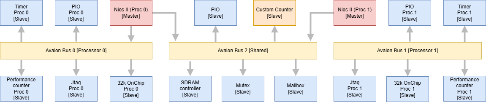
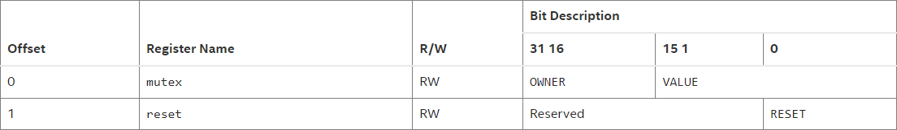
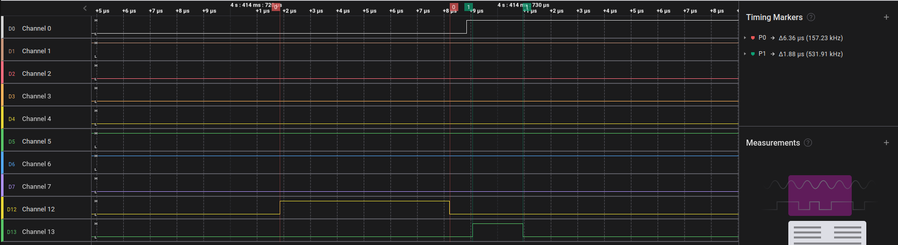
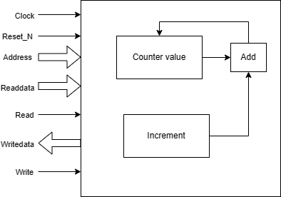

# Lab 3 : Multiprocessors


## 1 Introduction

This laboratory focuses on working with a multiprocessor design. To help us understand the advantages, the drawbacks and the additional hardware support we need to allow for a multiprocessor system. For this lab we will be using 2 NIOS-II processors that will try to access the same peripherals. This will be done by adding mutexes and mailboxes as well as a custom timer to the whole system.

## 2 System overview



Figure 1 : System Architecture

As we said in the introduction, the lab consists of 2 NIOS-II processors. Each of them have access to their own peripherals to be able to work independently to the other processor. Each of these subsystems have a timer, a performance counter, on-chip memory, a parallel port and a JTAG module for programming and debugging. Moreover, both processors are sharing peripherals namely SDRAM memory, a parallel port, mutexes and a mailbox. 

## 3 Mutex

A mutex is used to arbitrate the access to a resource that is shared between multiple processors and avoid synchronization issues. In our case, this resource is the shared PIO (PIO_2) and the synchronization issue we want to avoid is both processors reading the value at the same time, incrementing it on their side and rewriting it to the PIO which will cause one of the incrementation to be ignored.



Figure 2: Intel IP Hardware mutex register map

To lock the mutex, a processor tries to write its unique ID in the OWNER field and a non-zero value to the VALUE field. This will only work if the VALUE field is 0. The processor can then check if the lock was successful by checking if the OWNER field contains its ID.
To unlock the mutex, the same procedure is done but a zero is written to the VALUE field. This only works if the OWNER field contains the ID of the processor trying to unlock the mutex.

When using a mutex it is important that the time spent to acquire the lock and to release it is short enough to not have a big impact on the program execution. When using the mutex we could measure the time taken by each processor when trying to lock the mutex and to unlock the mutex. The results are given in the following table.


| action | measured time |
| ------ | ------------- |
| mutex lock | 6.36 µs |
| mutex unlock | 1.88 µs |

Table 1: mutex timings 

The image below shows the time measurement for a single mutex lock and unlock.



Figure 3: time measured for a single mutex lock and unlock

For more information on the Intel FPGA Avalon mutex core: https://www.intel.com/content/www/us/en/docs/programmable/683130/22-2/functional-description-15853.html

## 4 Mailbox

A hardware mailbox is used by a processor to send a message to the other processor. To avoid using too much storage this mailbox only stores a pointer to the memory location of the message. We have to be careful to use a pointer pointing to a space in memory to which both processors have access to or one processor will have trouble writing or reading the message.

The setup used for this part of the lab is the same as shown in Figure 1. For the software part we choose to have processor 0 to send the message to processor 1 that will then print it in its console. 

Both processors first set up the same shared mailbox. Processor 0 then loads a string into the shared memory and sends a message to the mailbox with the address of this string as a message. Processor 1 then tries to read a message from the mailbox. When a message becomes available it copies the string at the address from the shared memory into a string that is then displayed. 

Code for the processor 0: 
```c
volatile altera_avalon_mailbox_dev* mailbox = altera_avalon_mailbox_open(MAILBOX_SIMPLE_0_NAME, NULL, NULL);
unsigned char byte[] = {'B', 'o', 'n', 'j', 'o', 'u', 'r', '!', '\0'};
for(int i = 0; i < 9; i++) {
IOWR_8DIRECT(NEW_SDRAM_CONTROLLER_0_BASE+4, i, byte[i]);
}
alt_u32 message[2] = {NEW_SDRAM_CONTROLLER_0_BASE+4, NEW_SDRAM_CONTROLLER_0_BASE+4};
int status = altera_avalon_mailbox_send(mailbox, message, 0, POLL);
altera_avalon_mailbox_close(mailbox);
```
Code for processor 1:
```c
alt_u32* message[2];
volatile altera_avalon_mailbox_dev* mailbox = altera_avalon_mailbox_open(MAILBOX_SIMPLE_0_NAME, NULL, NULL);
while(1) {
altera_avalon_mailbox_retrieve_poll(mailbox, message, 0);
if(message != NULL) {
 char chars[9];
for(int i = 0; i < 9; i++) {
chars[i] = IORD_8DIRECT(message[1], i);
}
printf("%s\n", chars);
}
}
```

## 5 Custom counter

To allow two processors to increment a counter at the same time, we previously used a mutex to arbitrate the access to memory and to avoid both processors reading the value at the same time, incrementing it and rewriting it. This would lead to the value written first to be overwritten and one incrementation would be ignored. To make this task easier, we made a custom counter that acts as an avalon slave to which an increment value can be written but the incrementation of the counter is then done by the component itself. This avoids the synchronization problem explained before.



Figure 4 : Custom counter functional diagram


| Name | Address | Used bits | Access | Default | Description |
| ---- | ------- | --------- | ------ | ------- | ----------- |
| Counter | 0x0 | [31..0] | R/W | 0 | Register where the counter value is stored. Writing to this register resets the counter to the provided value. |
| Increment | 0x4 | [31..0] | W | 0 | Writing to this register increments the counter value |

Table 2 : Register map

## 6 Conclusion

In this lab we learned how to make two independent processes communicate and synchronize using different types of methods. This will be useful when using systems that have multiple processes that are working on the same data. Depending on the task to do, we saw that we can use different means of synchronization, the mailbox, the mutex or the custom counter. 
