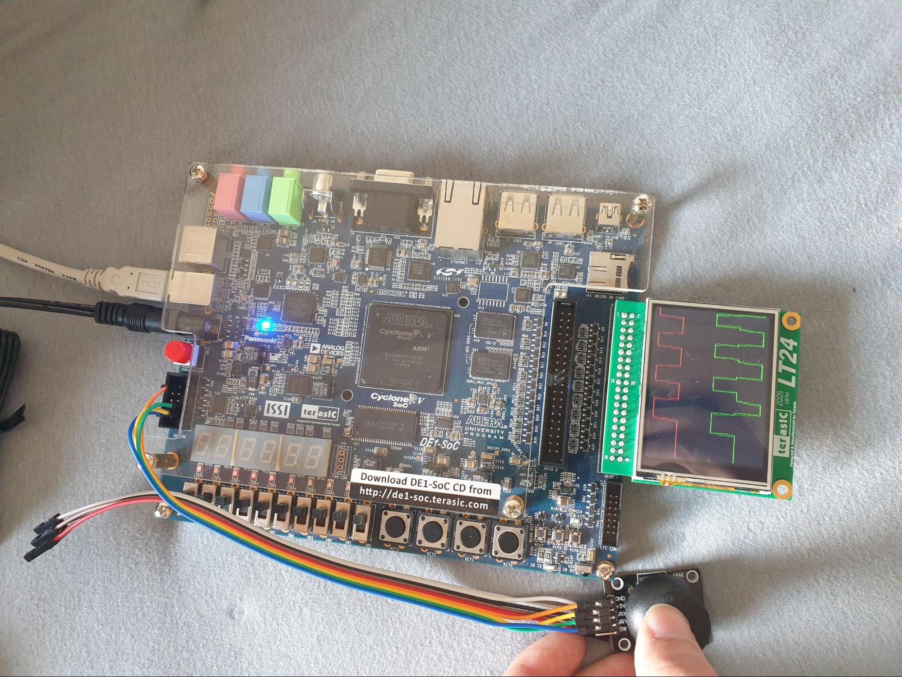
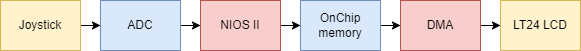
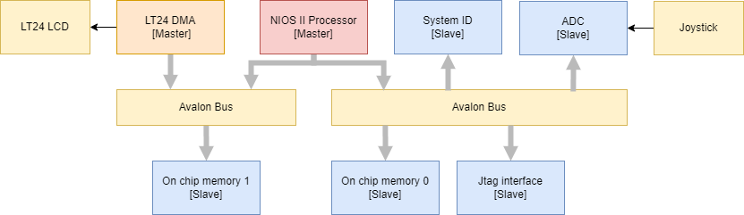
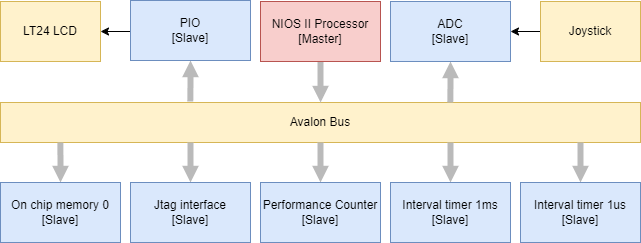
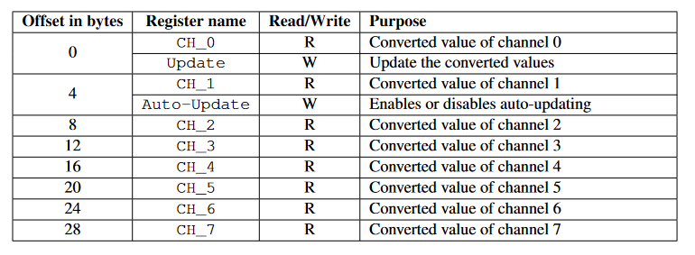
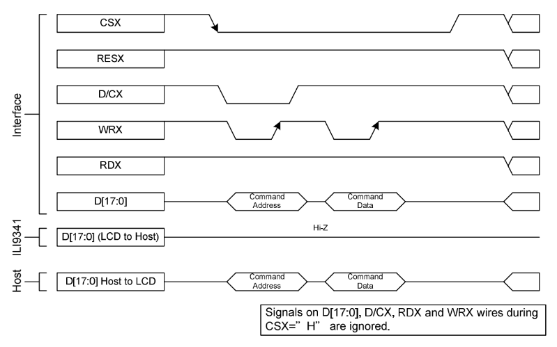
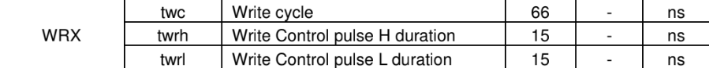
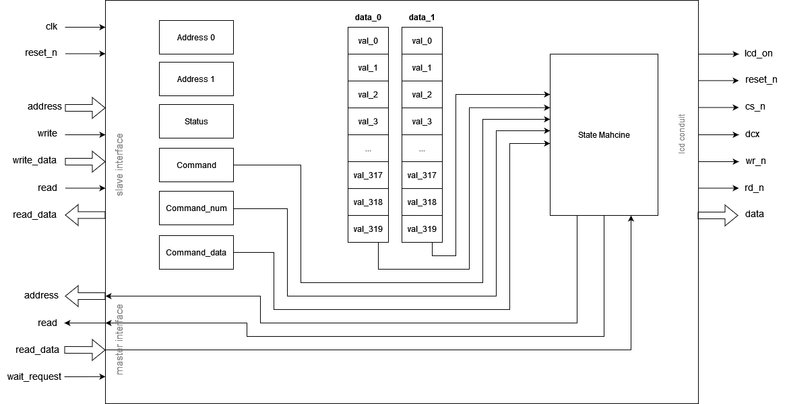
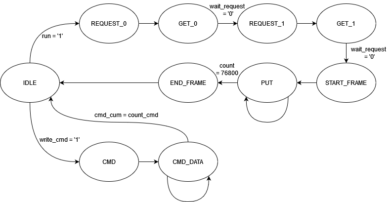

# Project : Oscilloscope


## 1 Introduction

For the lab 4 and final project we chose to make a basic two channel analog oscilloscope. Our system reads two values from the ADC and displays two lines that represent the values read on the LT24 LCD screen. The system will continuously read values from the ADC and will display the lines on the LCD. A new frame is displayed as soon as the LCD has pulled the values from the ADC. We achieved around 160fps with our application specific DMA.



Figure 1 : pipeline

## 2 Hardware overview

We built two systems for the purpose of this lab. The first one is a system with a custom LT24 DMA that will retrieve values from memory (in this case the 2 values from the ADC that have been rescaled by the CPU). The second system is a system that has a parallel port instead of a DMA. This allows us to set the pins to the LCD directly from the CPU. We will then be able to compare the difference in performance between a custom hardware accelerator and a software only implementation. 
The system with the LCD DMA is shown on the next figure.



Figure 2 : System with DMA

The system with the parallel port and the software implementation is shown in the next figure.



Figure 3: System with parallel port

### 2.1 ADC

For the purpose of this lab we used the ADC Controller for DE-series Board [1]. This allows us to access the ADC through an interface that is very easy to use and that doesn't need too much setup. Out of the 8 channels the core can access we will use 2 of them for the 2 axis of the joystick. The register map can be found on the following figure. 



Table 1: ADC controller register map

The Update register is used to begin a conversion on the chosen channels (in our case channel 0 and 1) but we won’t use this register. We will use the Auto-Update register. This will begin new conversions every time the previous conversions are finished. This will allow us to have the freshest conversion each time we ask the ADC for a channel value. The different CH_N registers contain the values that have been converted from the Nth channel. We won’t actually write directly in these registers because the core comes with functions that are available in the HAL (Hardware Abstraction Layer). This allows us to easily program the ADC Controller. To use the ADC Controller we used the following commands:

```c
#include "altera_up_avalon_adc.h"
// initialize the ADC Controller
alt_up_adc_dev* adc = alt_up_adc_open_dev(ADC_NAME);
// enable auto-update 
alt_up_adc_auto_enable(adc);
// read value for channel N
int value = unsigned int alt_up_adc_read(adc, channel_num)
```

## 2.2 LT24

As a display we use the LT24 LCD that we have already used last semester in the Embedded System course. This display has a resolution of 240x320 pixels. We will explain the protocol and all the output signals in this section. 
These are the signals that are used to control the LCD screen with their GPIO_1 bindings:
LCD_ON (pin 40): turns the display on
RS (pin 15) : Corresponds to the D/C signal and is used to tell the LCD if the signal sent is a command or data.
D[15-0] (pin 27 downto 16 and 6 to 9): This is a 16 bits bus to send the data to the LCD.
WR_N (pin 14): The LCD will sample data that is coming from the custom component on a rising edge of this signal
RD_N (pin 13): The LCD will provide data that will be read by the custom component on a rising edge of this signal.
CS_N (pin 28): The LCD is selected when this signal is low.
RES_N (pin 38): When this signal is low, it triggers a reset of the LCD.

The LT24 LCD has an ILI9341 controller that we need to configure in order to make the display work. It uses a particular protocol that we will need to implement in our custom DMA and in software (for the software only version).
In a write sequence to the LCD, there are some signals that we can keep constant: CS is held low while RES_N and RD_N are held high.
To write a command and then data, we start by putting the D/C low to say that we want to send a command and we can write our command to the D(data) bus. The LCD will read the command when there is a rising edge on the WR signal. To write the data, we need to put the D/C signal high to say that we want to send data, write our data to the data bus and put a rising edge on the WR signal to make the LCD read the data.



Figure 4 : writing sequence

There are timings to respect but knowing that our clock is 50Mhz (period of 20ns), we only need to worry about the WR signal “write cycle” timing.



Table 2: Timing specifications

The total time for a write cycle is more than two clock cycles. So this is something to be careful of during the implementation in the DMA. The software version is slow enough to not have to worry about these timings.

### 2.3 Joystick

To generate analog values for our oscilloscope, we’ll be using a joystick. This joystick is composed of two potentiometers and a button (which we’ll not use here). The resistance of the potentiometer will change depending on the position of the joystick. The potentiometer acts as a variable voltage divider, so we only need to provide a voltage (3.3v) and read the “divided” voltage, which will be between 0 and 3.3v. We connected both analog channels to channel 0 and 1 on the ADC port of the DE1-SoC card. After some tests, the ADC gave us values between 32768 and 36863 which we then used to normalize the values. The normalized values range from 10 to 110 and correspond to a “height” in pixels. This tells the LCD on which row a colored pixel should be displayed. We also add a 120 shift to the values of the second channel to avoid overlapping the first one.

## 3 DMA

We originally wanted to reuse the same LCD DMA as in the first semester but we were not able to make it work again because of the FIFO. So we made a new DMA from scratch that is more optimized for this specific task. It contains two arrays that will keep track of the values that have to be displayed on the LCD. The state machine overwrites old values to always have the newest ones in the arrays. We can find below the overview of the component. 



Figure 5: overview of the LCD DMA

The LCD DMA has 6 registers that are described below.
| Name | Address | Used bits | Access | Default | Description |
| --- | --- | --- | --- | --- | --- |
| Address0 | 0 | 32 | RW | 0x0000 | Stores the address where the ADC value for channel 0 is located |
| Address1 | 4 | 32 | RW | 0x0000 | Stores the address where the ADC value for channel 1 is located |
| run | 8 | 1 | RW | 0 | Write 1 to start the frame writing operation |
| write cmd | 8 | 1 | RW | 0 | Write 1 to send the command with its data for configuration |
| cmd cmd | 12 | 16 | RW | 0x00 | Set a new command to be sent for configuration and resets the command counter |
| cmd num | 16 | 3 | RW | 0x00 | Sets the number of commands/data to be sent for configuration |
| cmd datas | 20 | 16 | W | 0x00 | Adds data to the commands/data to be sent and increments the command counter |

Table 3 : Register map

The LCD DMA has a state machine that will keep track of what is to send to the LCD, what is to request to the memory and what to write when there is a command to send. We can find the state machine and the explanation of each state below.



Figure 6: State machine of the LCD DMA

<table>
    <tr>
        <td>IDLE</td>
        <td>Idle state</td>
    </tr>
    <tr>
        <td>Get_0</td>
        <td>Waits for the wait_request signal to turn off to get the value for the 0th ADC. It stores the value in the 0th array.</td>
    </tr>
    <tr>
        <td>Get_1</td>
        <td>Waits for the wait_request signal to turn off to get the value for the 1st ADC. It stores the value in the 1st array.</td>
    </tr>
    <tr>
        <td>Request_0</td>
        <td>Sends a read request to the memory at address address_0</td>
    </tr>
    <tr>
        <td>Request_1</td>
        <td>Sends a read request to the memory at address address_1</td>
    </tr>
    <tr>
        <td>State_Frame</td>
        <td>Starts a new frame by writing the start frame command to the LCD</td>
    </tr>
    <tr>
        <td>Put</td>
        <td>Writes all the pixels to the LCD. Depending on the values in the array writes black (no values) or color (green or red) (values between current and next value).</td>
    </tr>
    <tr>
        <td>End_Frame</td>
        <td>Ends a frame by writing the end frame command (nop) to the LCD</td>
    </tr>
    <tr>
        <td>CMD</td>
        <td>Writes the command to the LCD</td>
    </tr>
    <tr>
        <td>CMD_DATA</td>
        <td>Writes all data for the previous command</td>
    </tr>
</table>

Table 4: State of the LCD DMA

## 4 Software implementation

To be able to see what gains come from using a DMA for this specific application, we also implemented the same task using the NiosII as the only master. The protocol the LCD used was implemented in software and the processor sent them to the LCD through a basic parallel port.

## 5 Profiling

The profiling of the DMA was simply done using the logic analyser. We checked how much time passed between two occurrences of the D/C signal pulled low (which corresponds to the moment a new frame command is sent).
The profiling of the software only implementation was done using hardware profiling exactly like in Lab 2.

| | Time to display a frame | Frames per second |
| --- | --- | --- |
| DMA | 6.14 ms | 162.9 |
| Software | 640.12 ms | 1.6 |

Table 5 : profiling results

We can clearly see that the DMA has much better performances which was to be expected due to how precise we can make the timings in VHDL. But the disadvantage of a DMA is that it is application specific. The overhead for the DMA is 240 ns which corresponds to the time the DMA is asking for new ADC values from the memory. This time is very short compared to the time to write a full frame (time spent is 3 pixels).

## 6 Conclusion

The project works exactly as intended and even went over our expectations in terms of speed. We would have liked to add other features like changing the sampling speed but the time was lacking.

## 7 References

[1] ADC Controller for DE-series Board: https://ftp.intel.com/Public/Pub/fpgaup/pub/Intel_Material/18.1/University_Program_IP_Cores/Input_Output/ADC_Controller_for_DE_Series_Boards.pdf
